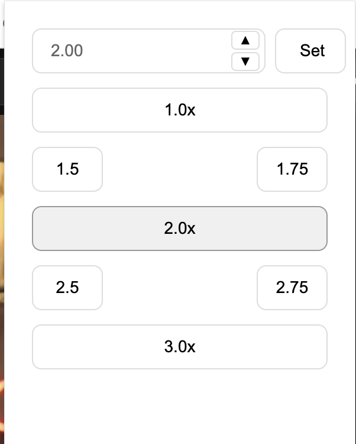

# YouTube Speed Enhancer

A Chrome extension that enhances YouTube video playback with comprehensive speed control options. This extension adds 2.5x and 3x speed options along with custom speed input functionality, allowing for playback rates from 0.1x to 16x.



## Features

- **Extended Speed Options**: Adds 2.5x and 3x speed options beyond YouTube's default speeds
- **Custom Speed Input**: Enter any playback speed between 0.1x and 16x
- **Persistent Settings**: Your speed settings persist across videos and sessions
- **Error Handling**: Comprehensive error handling for a smooth user experience
- **Native Integration**: Seamlessly integrates with YouTube's existing speed controls

## Installation

1. Clone this repository or download the ZIP file
2. Open Chrome and navigate to `chrome://extensions/`
3. Enable "Developer mode" in the top right
4. Click "Load unpacked" and select the extension directory

## Usage

1. Navigate to any YouTube video
2. Click the extension icon in your browser toolbar
3. Select a preset speed (1x to 3x) or enter a custom speed
4. The video will immediately update to play at your selected speed
5. Your speed setting will persist across videos until changed

## Technical Details

- Built with Manifest V3
- Uses Chrome Extensions API
- Implements Message Channel API for robust communication
- Handles YouTube's Single Page Application (SPA) navigation
- Maintains state across page reloads

## Development

### Prerequisites
- Node.js and npm
- Chrome browser

### Setup
1. Clone the repository
```bash
git clone https://github.com/yourusername/youtube-speed-enhancer.git
cd youtube-speed-enhancer
```

2. Install dependencies
```bash
npm install
```

3. Load the extension in Chrome as described in the Installation section

### Project Structure
```
├── manifest.json         # Extension manifest
├── popup.html           # Extension popup interface
├── popup.js            # Popup functionality
├── content.js          # Content script for YouTube integration
├── styles.css         # Extension styling
└── icons/             # Extension icons
```

## Contributing

1. Fork the repository
2. Create your feature branch (`git checkout -b feature/AmazingFeature`)
3. Commit your changes (`git commit -m 'Add some AmazingFeature'`)
4. Push to the branch (`git push origin feature/AmazingFeature`)
5. Open a Pull Request

## License

This project is licensed under the MIT License - see the [LICENSE](LICENSE) file for details.

## Acknowledgments

- Thanks to the Chrome Extensions team for their comprehensive documentation
- YouTube for providing a platform that allows for such enhancements
- All contributors who have helped improve this extension

## Support

If you encounter any issues or have suggestions for improvements, please open an issue on the GitHub repository.
